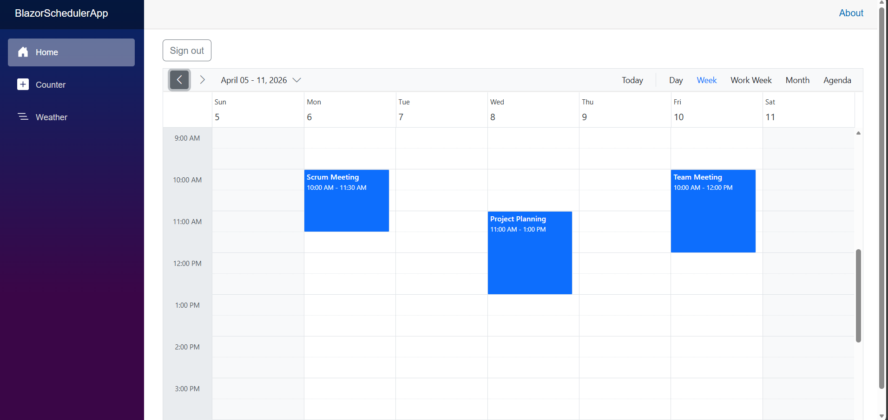
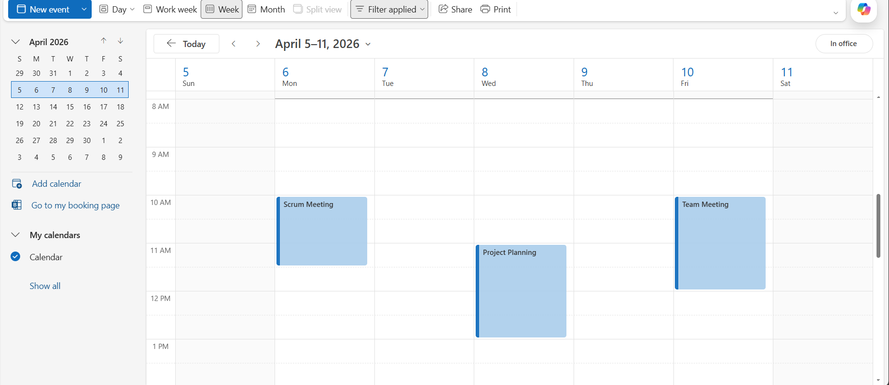

<!--
  howto.md
  A step-by-step guide to integrate Blazor Scheduler with Microsoft Graph using Azure AD
-->
# How to Integrate integrate Blazor Scheduler with Microsoft Graph using Azure AD

This repository contains a sample full-stack application demonstrating how to synchronize events between Microsoft Outlook and the Blazor Scheduler Component with Microsoft Graph API using Azure AD.

## Prerequisites
- dotnet (= 10.0)
- Need to have a personal Microsoft account 


## Setup

### Cloning the repository
    
- Clone the repository to your local machine

### Change key configuration in the appsettings.json file.

- Replace **Domain** , **TenantId** , **ClientId** and **ClientSecret** in the appsettings.json with your generated in AzureAD to integrate your outlook calender events to the Blazor scheduler.


## Running the Application
1. Navigate to `BlazorSchedulerApp` folder
    ```
    cd BlazorSchedulerApp
    ```
1. Rebuild the solution to restore Packages: 
    ```bash
    dotnet build
    ```
2. Start the application:
    ```bash
    dotnet run
    ```
3. Navigate to [`http://localhost:5050`](http://localhost:5050) in your browser.

4. Log in with the Microsoft account to display outlook calender events on the scheduler.

5. You can perform CRUD operation on the scheduler that will be reflected in the Outlook Calender

## Output Preview


*Image illustrating the Syncfusion Blazor Scheduler* 


*Image illustrating Outlook calendar events displayed in the Syncfusion Blazor Scheduler and synced through Microsoft Graph.*


# Troubleshooting
- **401 Unauthorized**: Check Domain, TenantId, CliendId and ClientSecret in appsettings.json.
- **Page Not Found**: Ensure to Enter the correct credentials to avoid bad request.